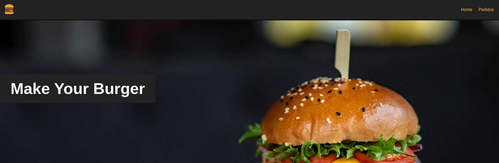
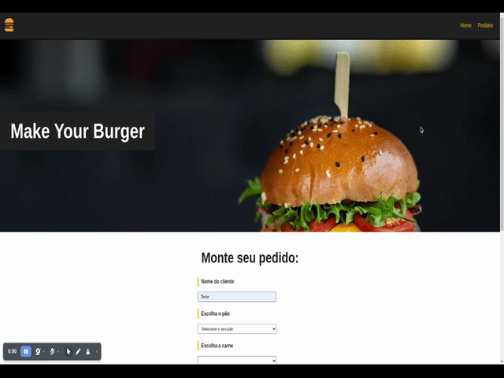

# Hamburgueria



Front: Vue, Type Script, Node. 
<br>
Server: Json server.

---
Desktop
<br>
 
<br>

---
Responsivo
<br>

<br>

## Project setup
```
yarn install
```

### Compiles and hot-reloads for development

```
yarn json
```
```
yarn serve
```

### Compiles and minifies for production
```
yarn build
```

### Customize configuration
See [Configuration Reference](https://cli.vuejs.org/config/).
